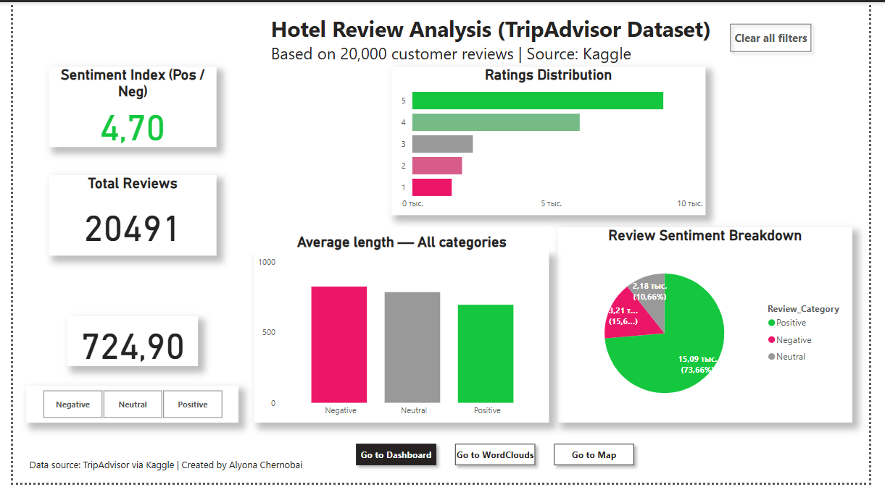

# 🏨 Hotel Reviews Analysis Dashboard

## 🧠 About the Project (EN)

This pet project analyzes hotel reviews from TripAdvisor using **Python** for data processing and **Power BI** for visualization. The scripts clean, classify, and enrich the data, which is then visualized through an interactive dashboard.

### ✨ Key Features:
- 🔄 Data cleaning and transformation
- 🧠 Sentiment classification (Positive / Neutral / Negative)
- ☁️ WordCloud generation
- 🌍 Random geographic location assignment
- 📊 Power BI dashboard with slicers and KPIs

---

## 📊 О проекте (RU)

Этот pet-проект создан для анализа отзывов об отелях с **TripAdvisor** с использованием **Python** и **Power BI**. Скрипты обрабатывают данные, классифицируют отзывы, создают облака слов и добавляют географическую информацию. Визуализация выполнена в виде интерактивного дашборда.

### ✨ Ключевые возможности:
- 🔄 Очистка и подготовка данных
- 🧠 Классификация отзывов по настроению (Позитивные / Нейтральные / Негативные)
- ☁️ Генерация WordCloud по категориям
- 🌍 Географическое распределение отзывов
- 📊 Интерактивный дашборд в Power BI

---

## 📁 Project Structure / Структура проекта

Hotel_reviews/
├── dashboard/
│   └── Dashboard_HotelReviews.pbix  ✅ # 📊 Power BI dashboard file

├── Hotel_reviews/
│ ├─ output/ # ☁️ PNG images of word clouds / Облака слов
│  ├── wordcloud_all.png
│  ├── wordcloud_negative.png
│  └── wordcloud_positive.png
│ 
│── Data_processing.py # 🔄 Data cleaning / Очистка данных
│── geo_module.py # 🌍 City assignment / География
│── word_cloud.py # ☁️ WordCloud generation / Облака слов
│── main.py # ▶️ Main script / Главный скрипт
│
├── images/
│ └── powerbi_dashboard.png # 🖼️ Dashboard screenshot / Скриншот дашборда
│
├── tripadvisor_hotel_reviews.csv # 📄 Raw dataset / Исходные данные
├── tripadvisor_reviews_ready.csv # 📄 Cleaned data / Подготовленные данные
├── tripadvisor_reviews_with_city.csv# 📄 Data + cities / Данные с городами

│── LICENSE
├── requirements.txt # 📦 Dependencies / Зависимости
└── README.md # 📘 This file / Документация

---

## 🚀 How to Run / Как запустить

1. 📦 Install dependencies / Установите зависимости:
   ```bash
   pip install -r requirements.txt

2. ▶️ Run the main script / Запустите скрипт:
   ```bash
   python Hotel_reviews/main.py

3. 📥 First run note (NLTK stopwords):

On the first run, NLTK will automatically download the English stopword list used for WordCloud generation. Internet connection is required.

⚠️ При первом запуске произойдёт автоматическая загрузка стоп-слов библиотеки NLTK. Нужен интернет.

4.  📥 Download Power BI Dashboard / Скачайте Дашборд:

You can open the interactive dashboard in Power BI Desktop:

📁 [Dashboard_HotelReviews.pbix](dashboard/Dashboard%20HotelReviews.pbix)

---

📦 Output Files / Результаты

tripadvisor_reviews_ready.csv — ✔️ Data with sentiment classification

tripadvisor_reviews_with_city.csv — 🌍 Data with city assignment

output/wordcloud_*.png — ☁️ WordCloud images by category

---
🧩 Requirements / Зависимости

- pandas
- numpy
- matplotlib
- wordcloud
- nltk

---

## 📊 Power BI Dashboard Preview

Below is a screenshot of the Power BI interactive dashboard built using this dataset:

Ниже представлен скриншот интерактивного дашборда Power BI, построенного на основе этого набора данных:




### 🔹 Main Metrics / Основные показатели:
🧠 Sentiment Index (Positive vs Negative)

📊 Ratings Distribution

📏 Average Review Length by Sentiment

🟢 Review Sentiment Breakdown

🌍 City Map Visualization

🎛️ Slicers and Navigation Buttons

### 🗂️ Fields Used / Используемые поля:

Rating — Отельный рейтинг

Review — Текст отзыва

Review_Category — Категория отзыва (Positive, Negative, Neutral)

Review_Length — Длина текста отзыва

City — Назначенный город

Sentiment Index — Индекс соотношения позитива/негатива

👩‍💻 Dashboard created by: Alyona Chernobai

---

📄 License

This project is licensed under the MIT License. See LICENSE for details

Вы можете использовать, копировать и модифицировать этот проект в любых целях при сохранении уведомления об авторстве.


